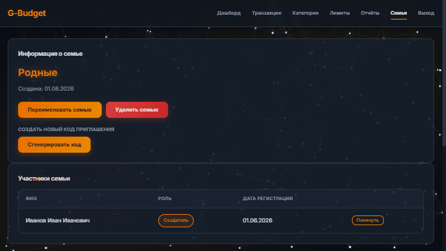
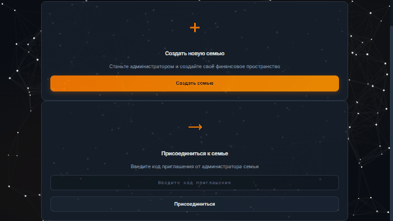
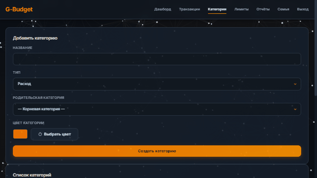
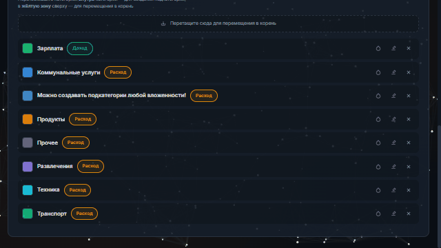
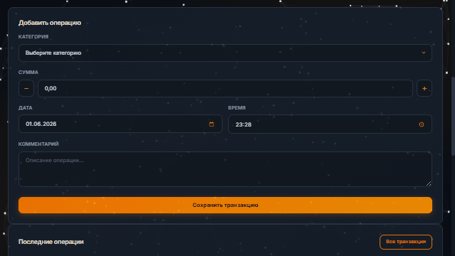
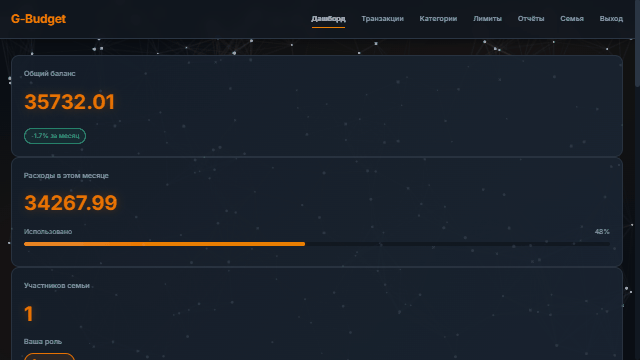
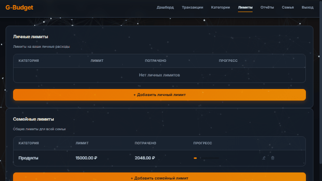
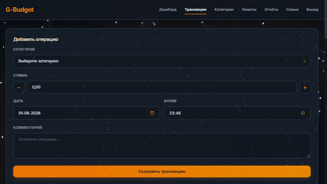

# G-budget

> Управляйте семеным бюджетом вместе

● Создайте семейное пространство и ведите совместный учёт

● Настраивайте категории операций по своим

● Сами опредетяйте категории своих операций

● Просматривайте понятную и гибкую аналитику

● Вносите планы бюджета для их удобного отслеживания


> #### **Простой старт**


> #### **Добавляйте семью**





> #### **Настраивайте свои категории**





> #### **Ведите учёт операций**



> #### **Удобная и понятная статистика**



> #### **Контролируйте расходы**



> #### **Удобная история операций**



> #### **Полная отчётность**


# Установка и запуск
### 1. Клонирование репозитория
```bash
git clone https://github.com/Till-Veber/G-budget
```
```bash
cd G-budget
```
### 2. Создание виртуального окружения
#### Windows
```bash
python -m venv venv
```
```bash
venv\Scripts\activate.bat
```
#### MacOS/Linux:
```bash
python3 -m venv venv
```
```bash
source venv/bin/activate
```
### 3. Установка зависимостей</span>
```bash
pip install -r requirements.txt
```
#### Если подключение не удаётся, можно использовать зеркала:</span>
Alibaba Cloud:
```bash
pip install -i https://mirrors.aliyun.com/pypi/simple/ --trusted-host mirrors.aliyun.com -r requirements.txt
```
Netherlands eScience Center:
```bash
pip install -i https://mirror.nlesc.nl/pypi/web/simple/ --trusted-host mirror.nlesc.nl -r requirements.txt
```
Tencent Cloud:
```bash
pip install -i https://mirrors.cloud.tencent.com/pypi/simple/ --trusted-host mirrors.cloud.tencent.com -r requirements.txt
```
Cloud.ru:
```bash
pip install -i https://mirror.cloud.ru/pypi/simple/ --trusted-host mirror.cloud.ru -r requirements.txt
```
VK Cloud:
```bash
pip install -i https://mirror.vk.com/pypi/simple/ --trusted-host mirror.vk.com -r requirements.txt
```
Yandex:
```bash
pip install -i https://mirror.yandex.ru/pypi/simple/ --trusted-host mirror.yandex.ru -r requirements.txt
```
И так далее
### 4. (Опционально) Создайте .env файл в корне проекта
```bash
SECRET_KEY=ваш-секретный-ключ-для-продакшена
```
(Или по умолчанию подставится dev-secret-key-2026)
### 5. Запуск приложения
```bash
python run.py
```
#### _Приложение будет доступно по http://127.0.0.1:5000_